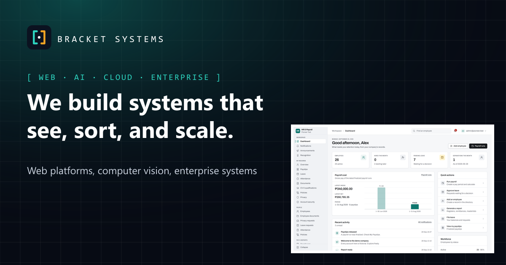

<div align="center">

# Bracket Systems

**We build systems that see, sort, and scale.**

The company website of Bracket Systems and the showcase for our flagship product, **HR & Payroll**.

[**Live site**](https://bracketsystems.vercel.app) ·
[Product](https://bracketsystems.vercel.app/products/hr-payroll) ·
[Product tour](https://bracketsystems.vercel.app/demo) ·
[Contact](https://bracketsystems.vercel.app/contact)




</div>

---

## About

Bracket Systems is **Kylie Cuadra, Prince Macalino and Jansen Oribello**. We build web platforms, computer-vision tools
and enterprise systems, and we make **HR & Payroll**: employee records, Philippine payroll, attendance, leave and
self-service in one platform.

This site covers who we are, our services and work, and the product itself. Product pages use real screenshots of the
running application, taken with a fictional demo company.

This project stands on its own. You don't need the HR & Payroll repository to install, build or run it. That
repository is only used, optionally, to re-capture product screenshots.

## Contents

- [Features](#features)
- [Quick start](#quick-start)
- [Tech stack](#tech-stack)
- [Project structure](#project-structure)
- [Editing content](#editing-content)
- [Product screenshots](#product-screenshots)
- [Environment variables](#environment-variables)
- [Deployment](#deployment)
- [Security](#security)
- [SEO, accessibility and performance](#seo-accessibility-and-performance)
- [Tests](#tests)
- [Team](#team)

## Features

- **Pages:** home, product, interactive product tour, services, solutions, work (one page per project), pricing,
  about and team, security, resources (FAQ, guides, release notes), contact, and the legal pages.
- **Mostly static:** Astro renders plain HTML. React loads only for the two parts that need it, the product tour and
  the contact form.
- **Content in one place:** every word on the site lives in `src/data/`. The pages only lay it out.
- **Real product screenshots** in AVIF and WebP at several widths.
- **Contact form** that sends through Resend. If Resend isn't set up, it falls back to email.
- **Security first:** a strict Content Security Policy, security headers and a rate-limited contact API.
- **Accessibility** targeting WCAG 2.2 AA, with axe checks on every page.

## Quick start

```bash
git clone <this-repo-url>
cd bracket-system-website
npm install
npm run dev          # http://localhost:4321
```

| Command | What it does |
|---|---|
| `npm run dev` | Starts the dev server at `http://localhost:4321` |
| `npm run build` | Builds for production into `dist/` and `.vercel/output/` |
| `npm run preview` | Serves the production build locally |
| `npm test` | Runs the Playwright tests: pages, accessibility, CSP, links, forms and API. Build first |
| `npm run check` | Runs TypeScript and Astro diagnostics |

Requires **Node.js 22.12 or later**.

## Tech stack

| Area | Choice |
|---|---|
| Framework | [Astro 7](https://astro.build): static pages, with React 19 islands only where there is interaction (product tour, contact form) |
| Styling | [Tailwind CSS 4](https://tailwindcss.com), with design tokens in `src/styles/global.css` |
| Fonts | Geist and JetBrains Mono, self-hosted through Fontsource (no Google Fonts requests) |
| Hosting | [Vercel](https://vercel.com) (`@astrojs/vercel`): static files plus one function, `/api/contact` |
| Analytics | Vercel Web Analytics. It is cookieless, you turn it on with an environment variable, and visitors can opt out on `/legal/cookies` |
| Email | [Resend](https://resend.com), used by the contact form |
| Tests | [Playwright](https://playwright.dev) + [axe-core](https://github.com/dequelabs/axe-core) |

## Project structure

```text
src/
├── pages/            one file per route; /api/contact is the only server route
├── layouts/          BaseLayout (SEO, JSON-LD, header/footer, reveal + analytics script), LegalLayout
├── sections/         page sections: Hero, PageHero, ServicesGrid, WorkGrid, TeamGrid, SecurityBand, CTA
├── components/       Button, Icon, Logo, Screenshot, ProductFrame, StatusBadge, ProductShowcase (React), ContactForm (React)
├── data/             ALL content: site.ts, team.ts, work.ts, services.ts, resources.ts, security.ts, legal.ts,
│   │                 products/ (one file per product), screenshots.json (generated)
├── lib/              shots.ts (screenshot srcsets), analytics.ts
└── styles/global.css design tokens and base styles
public/
├── screenshots/      product screenshots, AVIF + WebP at several widths (generated)
├── og/               social cards (generated)
├── resumes/          the team's published résumés
└── favicon.*, icon-*.png, apple-touch-icon.png (generated)
scripts/
├── capture-product.mjs      captures screenshots from a local HR & Payroll with its demo data
├── optimize-screenshots.mjs PNG → AVIF/WebP + src/data/screenshots.json
├── brand-assets.mjs         icons and social cards
└── serve-static.mjs         serves the build with vercel.json's headers (used by the tests)
tests/                site.spec.ts (built site), api.spec.ts (contact API)
```

## Editing content

All content is in `src/data/`. To change what the site says, edit these files, not the pages.

| What | Where |
|---|---|
| Company, navigation, emails | `site.ts`. `legalEntity` stays `null` until Bracket Systems is registered. After that, update the legal pages too (`legal.ts`, `src/pages/legal/`) |
| Team | `team.ts`: roles, bios and skills, as each person published them |
| Work | `work.ts`. Each project gets its own page at `/work/<slug>` |
| Services, solutions, FAQ, guides, release notes | `services.ts`, `resources.ts` |
| Security claims | `security.ts`. Keep it in line with the product's own security documentation |

> [!IMPORTANT]
> **Accuracy rule.** Only publish what is verified: in the product's code or docs, in the team's own published
> material, or confirmed by the team. No invented clients, numbers, testimonials or certifications. For features that
> aren't finished, set the `status` field (`available`, `api` or `planned`), and the site shows a badge for it.

### Adding a product

1. Add `src/data/products/<slug>.ts` exporting a `Product` (see `src/data/types.ts`), and register it in
   `src/data/products/index.ts`. `/products` lists it automatically.
2. Copy `src/pages/products/hr-payroll.astro` to `<slug>.astro` and point it at the new data. The sections are shared.
3. Add its screenshots (see below). Optionally, add a tour (`tour` steps) and a social card.

## Product screenshots

The screenshots are real. They are captured from a **local** HR & Payroll installation, signed in as the fictional
accounts from its development seed ("Pioneer Test Co.").

> [!WARNING]
> Never point the capture script at a real installation.

```bash
# With HR & Payroll running locally (web app on :5173, gateway on :8080) and its full demo seed loaded:
npm run screenshots:capture            # all shots, or: node scripts/capture-product.mjs dashboard payroll-run
npm run screenshots:optimize           # → public/screenshots/*.avif|webp and src/data/screenshots.json
npm run brand:assets                   # refresh social cards (they use two of the screenshots)
```

The capture script:

- Sets the product's display name ("HR & Payroll") and brand colour (the site's teal) through the product's own
  settings API, then clears them again afterwards.
- Replaces any file name that isn't demo data before it takes a shot.

Check every image before you commit it. Raw PNGs stay in `scripts/.raw/`, which git ignores.

## Environment variables

See `.env.example`. You don't need any of these for development.

| Variable | Purpose |
|---|---|
| `PUBLIC_SITE_URL` | Production origin, used for canonical URLs, the sitemap and social cards (default `https://bracketsystems.vercel.app`) |
| `PUBLIC_ANALYTICS` | Set to `vercel` to turn on Vercel Web Analytics. Also enable Web Analytics in the Vercel project |
| `RESEND_API_KEY`, `CONTACT_FROM` | Contact form delivery through [Resend](https://resend.com). `CONTACT_FROM` must be on a domain verified with Resend |
| `CONTACT_TO` | Comma-separated recipients (default: the three team addresses) |

Without the Resend settings, the form tells the visitor it can't send, and offers to open the same message as an email
instead. Nothing is lost.

## Deployment

The site is deployed on **Vercel**.

1. Import the repository in Vercel. It detects the Astro preset, and the build command is `npm run build`.
2. Set the environment variables above for Production.
3. If `PUBLIC_ANALYTICS=vercel`, enable **Web Analytics** in the project.
4. Add the custom domain, set `PUBLIC_SITE_URL` to it, and redeploy.

`vercel.json` adds the security headers: HSTS, `frame-ancestors 'none'`, nosniff, referrer policy, permissions policy
and COOP.

## Security

- **Content Security Policy:** Astro adds a `<meta>` policy to every page, with SHA-256 hashes of its own inline
  scripts and styles. Scripts, styles, fonts, images and connections are limited to this origin. There are no inline
  style attributes and no third-party scripts. Vercel serves the analytics script from the same origin.
- **Contact API:**
  - Accepts JSON only, caps the body at 8 KB, and uses Astro's origin check to block cross-site posts.
  - Validates input, strips control characters, uses a honeypot field, and allows 5 messages per 10 minutes per
    address. That limit applies per instance, so add a Vercel WAF rule for stronger protection.
  - HTML-escapes email content. Messages are not stored.
- **Secrets:** none are in the repository. Git ignores `.env*`, except `.env.example`.
- **Dependencies:** `npm audit` is clean. `path-to-regexp` is pinned to a patched 6.x through `overrides`, because the
  Vercel adapter's routing tool still asks for a vulnerable range.

Found a security issue? Please email the team (addresses in `src/data/site.ts`) instead of opening a public issue.

## SEO, accessibility and performance

**SEO**

- Each page has a unique title, a description, a canonical URL, and Open Graph and Twitter cards.
- JSON-LD: Organization and WebSite on every page, SoftwareApplication on the product page, FAQPage on resources, and
  CreativeWork on projects.
- `sitemap-index.xml` and `robots.txt` are generated.

**Accessibility (targeting WCAG 2.2 AA)**

- Semantic landmarks, a skip link, one `h1` per page, visible focus rings, labelled form fields with errors linked
  through `aria-describedby`, and WAI-ARIA tabs with arrow-key support.
- With reduced motion, the scroll reveal and animations are turned off.
- The tests run axe on every page.

**Performance**

- Static HTML, with JavaScript only for the two islands.
- AVIF/WebP screenshots in responsive `srcset`s, with explicit sizes so the layout doesn't shift.
- Lazy loading below the fold, self-hosted fonts, and long cache times on screenshots.

## Tests

`npm test` doesn't build the site, so run `npm run build` first.

```bash
npm run build
npm test
```

The tests check:

- **Every page:**
  - Returns status 200 and has one `h1`, a title, a description, a canonical URL and a CSP meta tag.
  - Has no console errors (so no CSP violations) and no broken images.
  - Has no serious or critical axe violations.
- **Layout and links:** no horizontal overflow at 1440, 1280, 1024, 768, 390 and 375 px, and every internal link
  resolves.
- **Behaviour:**
  - Security headers, `robots.txt`, the sitemap and the 404 page.
  - Keyboard use in the product tour, the mobile menu, and the contact form (validation, success, email fallback).
  - The analytics opt-out.
- **Contact API:** content type, validation, size limit, honeypot, unconfigured delivery, rate limit and methods.

## Team

Bracket Systems has been freelancing since 2019.

- **Christ Kylie Cuadra**
- **Prince Allyson Macalino**
- **Jansen Oribello**

Roles, bios and résumés are on the [About page](https://bracketsystems.vercel.app/about).

---

<div align="center">
<sub>© Bracket Systems · <a href="https://bracketsystems.vercel.app">bracketsystems.vercel.app</a></sub>
</div>
